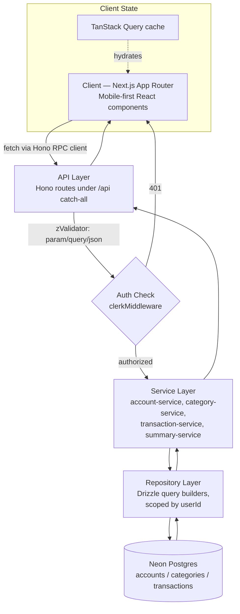
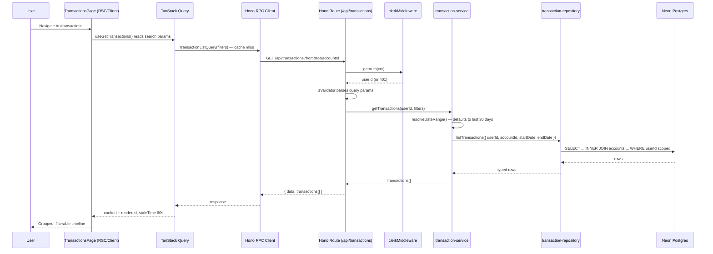
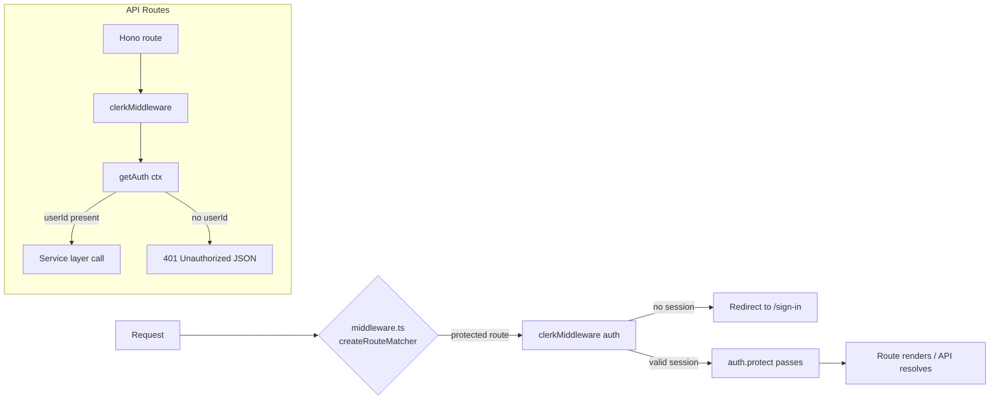
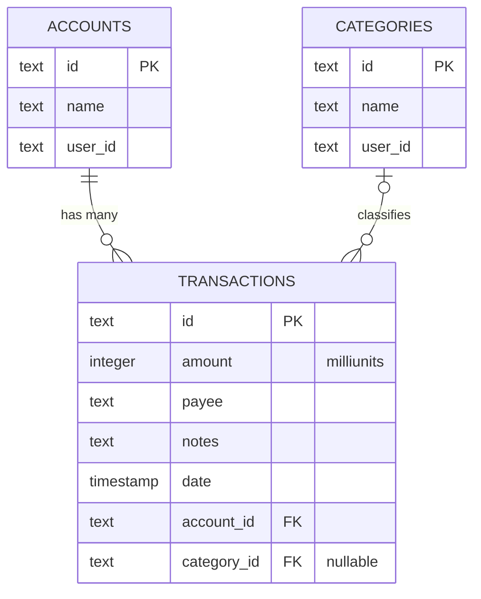

<div align="center">


# SplitFin

**Take control, split smart, save more.**

A mobile-first personal finance and expense-sharing platform, built for people who track money with friends as often as they track it alone.

[](https://nextjs.org)
[](https://www.typescriptlang.org)
[](https://orm.drizzle.team)
[](https://neon.tech)
[](https://clerk.com)
[](https://hono.dev)
[](https://tanstack.com/query)
[](LICENSE)

[Live Demo](#) · [Documentation](#table-of-contents) · [Report Bug](../../issues) · [Request Feature](../../issues)

</div>

---

## Table of Contents

- [Product Overview](#product-overview)
- [Core Features](#core-features)
- [Screenshots](#screenshots)
- [Technology Stack](#technology-stack)
- [System Architecture](#system-architecture)
- [Folder Structure](#folder-structure)
- [Request Lifecycle](#request-lifecycle)
- [Authentication Flow](#authentication-flow)
- [Database Design](#database-design)
- [Performance Optimizations](#performance-optimizations)
- [Security](#security)
- [API Documentation](#api-documentation)
- [Scaling the Codebase](#scaling-the-codebase)
- [Future Roadmap](#future-roadmap)
- [Development Philosophy](#development-philosophy)
- [Contributing](#contributing)
- [License](#license)
- [Acknowledgements](#acknowledgements)

---

## Product Overview

Most personal finance apps assume money is a solitary problem: one person, one wallet, one budget. In practice, money is shared constantly — rent with roommates, trips with friends, dinners with colleagues — and existing tools force you to bounce between a banking app, a spreadsheet, and a separate bill-splitting app to reconcile all of it.

**SplitFin exists to collapse that into one surface.** It combines personal account tracking, category-level spending analysis, and group expense settlement into a single mobile-first product, backed by a typed, layered backend that a team can actually maintain past the first release.

**Who it's for:**

| Persona | What SplitFin gives them |
|---|---|
| Individuals tracking multiple accounts | A unified balance view across banks, cards, wallets, and cash |
| Roommates / flatmates | Recurring shared bills with automatic settlement tracking |
| Friend groups (trips, dinners) | Per-group ledgers with simplified "who owes whom" debt graphs |
| Freelancers / early-career professionals | Category-level spend visibility without a full accounting suite |

**Representative use cases:**

- A user checks their combined balance across five accounts and drills into an individual account's detail (masked number, IFSC, credit utilization) without leaving the dashboard.
- A group of four splits a Goa trip; SplitFin computes the minimal set of transactions needed to settle all debts, rather than naively pairing every payer with every participant.
- A user notices spending drift in "Shopping" via the categories view and compares it against a rolling budget.

> **Design constraint:** every screen in SplitFin is built mobile-first (max width ~430px) and treated as a native-feeling app shell, not a responsive website. This is a deliberate product decision, not a limitation of the stack.

---

## Core Features

### 1. Unified Account Dashboard

- **Purpose:** Give users a single, glanceable view of net worth across heterogeneous account types (bank, credit card, debit card, wallet, cash, investment).
- **Business value:** Reduces the "app switching tax" that causes users to lose track of actual balances, which is the #1 reason people abandon budgeting tools.
- **Technical implementation:** `AccountCarousel3D` renders account cards via a custom Three.js scene (`account-carousel-scene.tsx`) with momentum-based drag physics and spring-snap centering; a 2D fallback (`AccountCarousel`) exists for reduced-motion / no-WebGL contexts. Data flows through `useGetAccounts` → `account-queries.ts` → the Hono `/api/accounts` route → `account-service.ts` → `account-repository.ts`.
- **Future improvements:** Live bank sync via Plaid/Setu, multi-currency support at the account level, and a lightweight WebGL fallback detector instead of manual failure state (`webglFailed`).

### 2. Category Intelligence

- **Purpose:** Turn raw transactions into a spending narrative — "what changed, and why."
- **Business value:** Category-level trend detection (`trend`, `budget` fields on `CategorySummary`) surfaces overspending before the monthly statement does, which is where most budgeting apps fail to retain users.
- **Technical implementation:** An orbital visualization (`CategoryOrbit`) arranges categories by spend share with a promotable "center" node; falls back to a `DonutChart` (SVG) when 3D isn't appropriate. Filtering by `needs` / `wants` / `lifestyle` / `others` groups is done client-side over data already fetched for the page, avoiding redundant network round-trips.
- **Future improvements:** Server-side budget alerts (push/email), merchant-level drill-down, and category auto-classification via a rules engine instead of static seed categories.

### 3. SplitPay — Group Expense Settlement

- **Purpose:** Track shared expenses per group and compute net balances without manual arithmetic.
- **Business value:** This is SplitFin's differentiator versus pure personal-finance tools (Mint-style apps) and pure splitting tools (Splitwise-style apps) — it unifies both instead of forcing a second app.
- **Technical implementation:** `SplitGroup` and `SplitMember` models carry `status` (`you-owe` / `you-are-owed` / `settled`) and computed `amount`/`totalAmount`. The settlement UI (`SettleBanner`, `GroupList`) is intentionally decoupled from the debt-simplification math (`SimplifiedDebt` type in `src/config/index.ts`) so the algorithm can be swapped for a proper minimum-transaction-count solver without touching components.
- **Future improvements:** A real debt-simplification service (currently the type exists but the greedy-graph solver is not yet wired to the UI), UPI deep-link settlement, and per-group currency support.

### 4. Transaction Timeline

- **Purpose:** A chronological, filterable ledger of every transaction across every account.
- **Business value:** Trust in a finance product is built on transparency — every number shown elsewhere in the app must be traceable to a raw transaction.
- **Technical implementation:** `TransactionTimeline` groups transactions by month (`MonthGroup`) with type filters (`income` / `expense` / `transfer` / `refund`) applied client-side against `FilterChips`. On the data side, `GET /api/transactions` supports `from`, `to`, and `accountId` query params, resolved server-side in `transaction-service.ts` with sane 30-day defaults when the client omits a range.
- **Future improvements:** Cursor-based pagination (currently the route returns the full filtered set — acceptable at seed-data scale, not at production scale), full-text merchant search, and receipt image attachments.

### 5. Financial Summary Engine

- **Purpose:** Power the dashboard's headline numbers (income, expenses, remaining, category breakdown, daily cash flow) from a single aggregation pass.
- **Business value:** Consistent numbers across every screen — the summary card, the cash flow chart, and the category donut all read from the same computed source instead of drifting from independent client-side calculations.
- **Technical implementation:** `summary-repository.ts` runs three Postgres aggregate queries in parallel (`Promise.all`) — financial totals, category totals, and daily totals — each scoped by an `and()`-composed `WHERE` clause shared via a single `periodWhere()` helper. Percentage-change math (`calculatePercentageChange`) compares the requested period against an equal-length prior period computed via `date-fns`.
- **Future improvements:** Materialized rollup tables for multi-year history, background pre-aggregation via a job queue instead of on-request computation.

---

## Screenshots

> Screenshots live under `assets/screenshots/`. Replace placeholders with current builds before publishing a release.

<table>
<tr>
<td width="50%">

**Dashboard Overview**


</td>
<td width="50%">

**What it does:** Landing screen after auth — hero balance card, money-in/out/net row, quick actions, account previews, cash flow chart, category preview, SplitPay preview, and rotating insight cards.

**Why it exists:** A single scroll should answer "where do I stand right now" without a single tap.

**APIs powering it:** `GET /api/summary`, `GET /api/accounts`

**Tables/collections used:** `accounts`, `transactions`, `categories`

**Key interactions:** Balance visibility toggle (`Eye`/`EyeOff`), swipeable quick actions, tap-through account previews to `/accounts`.

</td>
</tr>
<tr>
<td width="50%">

**Transactions Overview**


</td>
<td width="50%">

**What it does:** Full chronological ledger grouped by month, with income/expense/transfer/refund filter chips and a flow summary (income vs. expense vs. net, with a progress ring for savings rate).

**Why it exists:** The auditable source of truth behind every other aggregated view in the app.

**APIs powering it:** `GET /api/transactions?from&to&accountId`

**Tables/collections used:** `transactions`, `accounts`, `categories`

**Key interactions:** Type filter chips (shared `FilterChips` component with layout animation), scan-bill and import actions, per-transaction split/recurring/receipt badges.

</td>
</tr>
<tr>
<td width="50%">

**SplitPay Overview**


</td>
<td width="50%">

**What it does:** Net balance hero (you owe / net / you're owed), active group list with settlement progress bars, a "Settle Now" banner, and a filterable list of people you split with.

**Why it exists:** Turns "who owes who" from a group-chat argument into a computed, glanceable answer.

**APIs powering it:** Currently served from typed mock data (`src/lib/data.ts`) pending the `/api/groups` and `/api/settlements` routes defined in `src/config/constants.ts` (`API.groups`, `API.settlements`).

**Tables/collections used (planned):** `groups`, `group_members`, `expenses`, `settlements`

**Key interactions:** Direction filter chips (`you-owe` / `owes-you` / `settled`), animated per-member list with `layout` transitions on filter change.

</td>
</tr>
<tr>
<td width="50%">

**Categories Overview**


</td>
<td width="50%">

**What it does:** Total-spend hero with a 3D category ring (WebGL) or donut-chart fallback, a group filter (needs/wants/lifestyle/others), an orbital category explorer, and a budget-comparison insight card.

**Why it exists:** Spend awareness at the category level is the single strongest predictor of budget adherence.

**APIs powering it:** `GET /api/summary` (category aggregation), `GET /api/categories`

**Tables/collections used:** `categories`, `transactions`

**Key interactions:** Tap a category node to promote it to center (orbit re-arranges via shared `layoutId` animation), month selector, budget progress bars with near-limit warnings.

</td>
</tr>
<tr>
<td width="50%">

**Accounts Overview**


</td>
<td width="50%">

**What it does:** 3D account carousel, active account detail grid (masked number, IFSC, interest rate, etc.), portfolio summary with sparkline, upcoming bills with AutoPay indicators, and smart insights.

**Why it exists:** Every account type (bank, card, wallet, cash, investment) has structurally different metadata — this screen renders that per-type shape without a one-size-fits-all layout.

**APIs powering it:** `GET /api/accounts`, `GET /api/accounts/:id`

**Tables/collections used:** `accounts`, `transactions` (for bills/insights derivation)

**Key interactions:** Filter chips by account type, drag/swipe carousel with keyboard arrow-key support, copy-to-clipboard on masked identifiers.

</td>
</tr>
</table>

---

## Technology Stack

Every choice below was made for a specific, stated reason — not defaults.

| Layer | Technology | Why this, specifically |
|---|---|---|
| Framework | **Next.js 14 (App Router)** | Colocated route groups (`(auth)`, `(dashboard)`) give clean auth/layout separation without a custom router; RSC boundaries keep data-fetching close to routes while client components stay isolated to interactive leaves. |
| Language | **TypeScript (strict)** | A finance product cannot afford `any`-shaped money. Strict mode plus Zod schemas at every API boundary means a malformed amount fails at the edge, not silently in a chart. |
| API layer | **Hono**, mounted via `hono/vercel` under a single Next.js catch-all route | Hono gives Express-like route composition and `zValidator` middleware inside a serverless-friendly, edge-runtime-compatible package — avoiding the overhead of a separate API server while keeping route handlers thin. |
| ORM | **Drizzle ORM** | SQL-first, fully typed query builder with zero runtime magic — `db.select(...).from(...).where(...)` reads like the SQL it generates, which matters when debugging aggregate queries in `summary-repository.ts`. |
| Database | **Neon Postgres (serverless)** | Serverless connection pooling over HTTP (`@neondatabase/serverless`) works natively with edge runtimes; branching support makes preview-deployment databases trivial. |
| Auth | **Clerk** | Drop-in session management, JWT verification via `@hono/clerk-auth` middleware directly inside Hono routes, and pre-built `<SignIn>`/`<SignUp>` components — removes an entire category of auth bugs from a small team's surface area. |
| Data fetching / caching | **TanStack Query v5** | Every domain (`accounts`, `categories`, `transactions`, `summary`) follows the same query-key + query-options + mutation-factory pattern (see `features/*/api/`), giving consistent cache invalidation without hand-rolled state. |
| Styling | **Tailwind CSS** + CSS custom properties (`globals.css`) | Utility classes for velocity, but all color/spacing tokens are full-value CSS variables (not Tailwind theme-only) so the same tokens can be consumed directly in inline styles, SVG, and `color-mix()` expressions used throughout the glassmorphism system. |
| Motion | **Framer Motion** | Declarative `layoutId` shared-element transitions power the category-orbit promote/demote animation and filter-chip active-state indicator without manual FLIP calculations. |
| 3D | **Three.js / React Three Fiber / Drei** | The account carousel and category ring are genuinely interactive 3D scenes (drag physics, momentum, spring-snap) — a DOM/CSS-only approach could not deliver the physically-based lighting and depth cueing used for account-type theming. |
| Charts | **Recharts** | Declarative, composable chart primitives for the cash-flow bar chart; swapped for hand-rolled SVG (`DonutChart`, sparkline) where full control over shared-element animation was required. |
| Schema validation | **Zod** + `drizzle-zod` | A single schema (`insertAccountSchema`, `insertTransactionSchema`, etc.) generates both the Drizzle insert type and the Hono route validator — one source of truth for what a valid row looks like. |

---

## System Architecture



**Layer responsibilities:**

- **Client (Next.js App Router):** Route groups separate concerns cleanly — `(auth)` for Clerk-hosted sign-in/sign-up, `(dashboard)` for the protected mobile shell. Components are feature-sliced (`src/features/<domain>/components|sections|api`) rather than type-sliced, so a domain's UI, data hooks, and API client all live together.
- **API layer (Hono):** A single catch-all route (`app/api/[[...route]]/route.ts`) mounts sub-routers per domain. Each route file owns exactly three responsibilities: auth extraction (`getAuth(ctx)`), input validation (`zValidator`), and response shaping (`ctx.json(...)`) — zero business logic lives here.
- **Service layer:** Thin orchestration functions that translate a verified `userId` and validated payload into repository calls. This is the seam where cross-cutting business rules (e.g., default date ranges in `transaction-service.ts`, category top-3-plus-other bucketing in `summary-service.ts`) live, kept deliberately separate from both HTTP concerns and SQL.
- **Repository layer:** The only layer that imports Drizzle and touches `db` directly. Every query is scoped by `userId` at the WHERE-clause level — there is no repository function that can return another user's row, by construction.
- **Database (Neon Postgres):** Three core tables (`accounts`, `categories`, `transactions`) with foreign-key cascades from `transactions` to both parents, described in [Database Design](#database-design).

---

## Folder Structure

```text
splitfin/
├── src/
│   ├── app/                        # Next.js App Router — routes only, no business logic
│   │   ├── (auth)/                 # Public route group: Clerk-hosted sign-in/sign-up
│   │   ├── (dashboard)/            # Protected route group: the mobile app shell
│   │   │   ├── page.tsx            # Overview/dashboard
│   │   │   ├── accounts/           # Accounts screen
│   │   │   ├── categories/         # Categories screen
│   │   │   ├── splitpay/           # SplitPay screen
│   │   │   └── transactions/       # Transactions screen
│   │   ├── api/[[...route]]/       # Hono catch-all — the entire REST surface mounts here
│   │   └── layout.tsx              # Root layout: ClerkProvider + QueryProviders
│   │
│   ├── features/                   # Feature-sliced domains — the primary unit of ownership
│   │   └── <domain>/
│   │       ├── api/                # query-keys, queries, mutations, hooks — one pattern per domain
│   │       ├── components/         # Domain-specific presentational components
│   │       └── sections/           # Page-level composition of components for a specific screen
│   │
│   ├── server/                     # Backend-only code, never imported by client components
│   │   ├── repositories/           # Drizzle queries, scoped by userId — the only DB access point
│   │   └── services/               # Orchestration between routes and repositories
│   │
│   ├── db/                         # Drizzle schema, client, and generated types
│   ├── drizzle/                    # Generated SQL migrations + snapshots (drizzle-kit output)
│   ├── shared/                     # Cross-domain, reusable primitives
│   │   ├── components/             # Design-system-level components (GlassCard, DonutChart, etc.)
│   │   ├── three/                  # Three.js scene components (carousel, category ring, hero)
│   │   ├── navigation/             # Bottom nav shell
│   │   ├── lib/                    # Shared formatting helpers (currency, greetings)
│   │   └── ui/                     # Low-level primitives (Button, etc.)
│   │
│   ├── lib/                        # App-wide utilities: Hono RPC client, query keys, cn(), unit math
│   ├── config/                     # Constants, routes, copy strings, domain types
│   ├── providers/                  # React context providers (TanStack Query client)
│   ├── hooks/                      # Cross-feature hooks not tied to one domain
│   ├── scripts/                    # Seed scripts (bun-run, not part of the build)
│   └── types/                      # Shared TypeScript types consumed by both UI and mock data
│
└── public/                         # Static assets, demo CSV, logos
```

**Why feature-slicing over type-slicing:** grouping `api/`, `components/`, and `sections/` under `features/accounts/` rather than under global `hooks/`, `components/`, `pages/` directories means a new contributor working on SplitPay never needs to reason about Accounts code to make a change — the blast radius of any PR is visible from the changed folder alone.

**Why `server/` is separated from `features/*/api/`:** `features/*/api/` contains client-side query/mutation hooks (they import `@tanstack/react-query` and the Hono RPC client). `server/` contains code that only ever runs on the server (route handlers, services, repositories) and never gets bundled into client JavaScript — this boundary is enforced by import direction, not just convention.

---

## Request Lifecycle

Example: a user opens the Transactions screen for the current month.



Every mutation (create/edit/delete transaction, account, category) follows the same shape in reverse, and finishes with `invalidateAfterWrite()` — a single helper that invalidates the transaction list, the transaction detail (if applicable), and the summary cache together, so a new transaction is reflected in both the ledger and the dashboard totals without a manual refetch call anywhere in a component.

---

## Authentication Flow



- **Login:** Clerk's hosted `<SignIn>` / `<SignUp>` components handle credential collection, MFA, and session cookie issuance — no custom password logic exists in the codebase.
- **JWT / session:** Clerk issues a signed session token; `@hono/clerk-auth`'s `clerkMiddleware()` verifies it on every API route and exposes `getAuth(ctx)` to extract `userId`.
- **Middleware:** `middleware.ts` uses `createRouteMatcher` to mark the root route as protected at the edge, before any component renders — unauthenticated users never receive dashboard markup.
- **Protected routes:** Every `(dashboard)` route implicitly requires a session because every underlying API call rejects requests without a verified `userId`; there is no client-only protection to bypass.
- **Role permissions:** Not yet implemented — see [Future Roadmap](#future-roadmap). Today, authorization is single-tenant (a user can only ever see rows where `userId` matches their own session), enforced at the repository query level, not just the route level.
- **Session validation:** Every repository function takes `userId` as an explicit parameter and includes it in the `WHERE` clause — session scoping is structural, not an afterthought bolted onto a shared query.

---

## Database Design



- **Collections/tables:** `accounts`, `categories`, `transactions` — intentionally minimal. Group/settlement tables (`groups`, `group_members`, `expenses`, `settlements`) are designed in the type layer (`src/config/index.ts`) but not yet migrated; see roadmap.
- **Relationships:** `transactions.account_id → accounts.id` with `ON DELETE CASCADE` (deleting an account removes its transaction history — a deliberate consistency choice over orphaned rows). `transactions.category_id → categories.id` with `ON DELETE SET NULL` (deleting a category should never destroy financial history — it should fall back to "Uncategorized").
- **Money representation:** Amounts are stored as integer **milliunits** (`convertAmountToMilliunits` / `convertAmountFromMilliunits`), never floats — this eliminates an entire class of floating-point rounding bugs common in naive finance apps.
- **Indexes:** Currently relying on primary-key indexes and Neon's default planner. At production scale, a composite index on `(account_id, date)` is the first addition — every list query filters and sorts on exactly that pair.
- **Constraints:** All tenant isolation is enforced via application-level `WHERE user_id = ?` scoping rather than Postgres Row-Level Security today; RLS is a natural hardening step once the schema stabilizes.
- **Scalability path:** The repository layer already isolates all raw SQL, so introducing read replicas, materialized summary views, or a caching layer in front of `summary-repository.ts` requires touching one file, not the API surface.

---

## Performance Optimizations

| Technique | Where it's applied |
|---|---|
| **Query caching** | Every domain query sets `staleTime: 60 * 1000` via shared query-option factories (`account-queries.ts`, `transaction-queries.ts`, `summary-queries.ts`) — one tunable constant per domain, not scattered magic numbers. |
| **Parallel aggregation** | `summary-service.ts` runs financial totals, category totals, and daily totals via a single `Promise.all`, instead of sequential awaits — cuts summary endpoint latency roughly 3x under I/O-bound conditions. |
| **O(1) gap-filling** | `fillMissingDays` in `summary-service.ts` was rewritten from an `Array.find` (`O(n²)` across a date range) to a `Map`-backed lookup (`O(n)`) — documented inline with the before/after complexity. |
| **Code splitting** | All Three.js scenes (`AccountCarouselScene`, `CategoryRingScene`, `HeroBankScene`) are loaded via `next/dynamic` with `ssr: false` — WebGL never ships in the server bundle and never blocks first paint. |
| **Optimistic-feeling mutations** | Every mutation factory (`account-mutations.ts`, `transaction-mutations.ts`) pairs a single `toast` call with a scoped `invalidateAfterWrite` — cache invalidation is centralized so UI consistency doesn't depend on each component remembering which keys to bust. |
| **Reduced-motion respect** | Every animated component (`CategoryOrbit`, `AnimatedAmount`, Three.js scenes) checks `useReducedMotion()` and short-circuits animation — this is both an accessibility requirement and a performance win on low-power devices. |
| **Guarded bulk operations** | Repository `deleteMany*` functions short-circuit on an empty `ids` array before calling Drizzle's `inArray()` — prevents driver-dependent invalid-SQL or full-table-scan edge cases on empty bulk actions. |
| **Serverless-friendly DB access** | Neon's HTTP driver (`@neondatabase/serverless`) avoids the cold-start cost of TCP connection pooling in edge/serverless runtimes. |

---

## Security

| Concern | Implementation |
|---|---|
| **Authentication** | Delegated entirely to Clerk — no custom session/token logic to audit or get wrong. |
| **Authorization** | Every repository function requires an explicit `userId` and applies it in the SQL `WHERE` clause — there is no code path that queries `transactions` without a tenant filter. |
| **Input validation** | Every Hono route validates `param`, `query`, and `json` via `zValidator`, backed by Zod schemas generated from the Drizzle schema (`drizzle-zod`) — the same schema defines what's valid for both the database and the wire. |
| **Rate limiting** | Not yet implemented at the application layer — recommended: Vercel's Edge Middleware rate limiting or Upstash Ratelimit in front of the Hono catch-all, tracked in the roadmap. |
| **XSS** | React's default JSX escaping covers rendered content; no `dangerouslySetInnerHTML` is used anywhere in the codebase. |
| **CSRF** | Clerk session cookies are `SameSite`-scoped by default; all state-changing routes require a valid Clerk session, not just cookie presence. |
| **Password hashing** | Handled entirely by Clerk's infrastructure — SplitFin never stores or touches a raw or hashed password. |
| **Secure headers** | Recommended hardening: add a `next.config.mjs` `headers()` block for `Content-Security-Policy`, `X-Frame-Options`, and `Strict-Transport-Security` — not yet configured, tracked in the roadmap. |
| **Environment variables** | `DATABASE_URL`, Clerk keys, and `NEXT_PUBLIC_APP_URL` are typed via `environment.d.ts` and loaded via `.env.local` (git-ignored); no secret is ever committed or hardcoded. |

---

## API Documentation

All routes are mounted under `/api` via a single Hono catch-all (`app/api/[[...route]]/route.ts`). Every route requires a valid Clerk session unless stated otherwise.

<details>
<summary><strong>Accounts</strong> — <code>/api/accounts</code></summary>

| Method | Path | Description |
|---|---|---|
| `GET` | `/api/accounts` | List all accounts for the authenticated user |
| `GET` | `/api/accounts/:id` | Fetch a single account by ID |
| `POST` | `/api/accounts` | Create an account (`{ name }`) |
| `PATCH` | `/api/accounts/:id` | Rename an account |
| `DELETE` | `/api/accounts/:id` | Delete an account (cascades to its transactions) |
| `POST` | `/api/accounts/bulk-delete` | Delete multiple accounts (`{ ids: string[] }`) |

</details>

<details>
<summary><strong>Categories</strong> — <code>/api/categories</code></summary>

| Method | Path | Description |
|---|---|---|
| `GET` | `/api/categories` | List all categories for the authenticated user |
| `GET` | `/api/categories/:id` | Fetch a single category |
| `POST` | `/api/categories` | Create a category (`{ name }`) |
| `PATCH` | `/api/categories/:id` | Rename a category |
| `DELETE` | `/api/categories/:id` | Delete a category (transactions fall back to uncategorized) |
| `POST` | `/api/categories/bulk-delete` | Delete multiple categories |

</details>

<details>
<summary><strong>Transactions</strong> — <code>/api/transactions</code></summary>

| Method | Path | Description |
|---|---|---|
| `GET` | `/api/transactions?from&to&accountId` | List transactions, defaults to the trailing 30 days |
| `GET` | `/api/transactions/:id` | Fetch a single transaction |
| `POST` | `/api/transactions` | Create a transaction |
| `POST` | `/api/transactions/bulk-create` | Bulk-create (CSV import flow) |
| `PATCH` | `/api/transactions/:id` | Edit a transaction |
| `DELETE` | `/api/transactions/:id` | Delete a transaction |
| `POST` | `/api/transactions/bulk-delete` | Bulk-delete transactions |

</details>

<details>
<summary><strong>Summary</strong> — <code>/api/summary</code></summary>

| Method | Path | Description |
|---|---|---|
| `GET` | `/api/summary?from&to&accountId` | Aggregated income/expenses/remaining, category breakdown, and daily cash-flow series, with period-over-period percentage change |

</details>

Client access to every route is fully typed end-to-end via Hono's RPC client (`hc<AppType>`) — a change to a route's response shape is a TypeScript error in the consuming hook, not a runtime surprise.

---

## Scaling the Codebase

As more developers join, the architecture is designed to keep merge conflicts and onboarding time low:

- **New domain = new folder.** Adding "Budgets" means creating `src/features/budgets/{api,components,sections}` and `src/server/{repositories,services}/budget-*` — no existing file needs to be touched to add a feature end-to-end.
- **Query-key discipline.** Every domain's `query-keys.ts` follows the same `all → lists()/details() → list()/detail(id)` hierarchy, so a new contributor can predict cache-invalidation behavior without reading the mutation code.
- **Repository as the only DB boundary.** No component, hook, or service outside `src/server/repositories/` imports `db` directly — enforceable via a lint rule (`no-restricted-imports`) as the team grows.
- **Typed contracts across the stack.** Hono's RPC client means the frontend and backend can never silently drift — a backend route signature change breaks the build, not a production request.

---

## Future Roadmap

- [ ] Migrate SplitPay from mock data to real `groups` / `group_members` / `expenses` / `settlements` tables (types already exist in `src/config/index.ts`)
- [ ] Wire the minimum-transaction debt-simplification algorithm to the settlement UI
- [ ] Role-based permissions for shared groups (admin/member, per `MEMBER_ROLES`)
- [ ] Cursor-based pagination on `/api/transactions` and `/api/summary`
- [ ] Rate limiting on all mutating routes (Upstash Ratelimit or Edge Middleware)
- [ ] Postgres Row-Level Security as a defense-in-depth layer beneath application-level scoping
- [ ] Bank account sync (Plaid / Setu Account Aggregator) to replace manual account entry
- [ ] Multi-currency accounts with live FX conversion
- [ ] Push notifications for budget threshold and settlement reminders
- [ ] Composite database indexes (`account_id, date`) once data volume justifies it
- [ ] Security headers (`CSP`, `HSTS`, `X-Frame-Options`) in `next.config.mjs`

---

## Development Philosophy

- **Thin routes, thick services, isolated repositories.** A Hono route file should be readable top to bottom in ten seconds: validate, authenticate, delegate, respond. Business rules live in services; SQL lives in repositories. This is enforced by convention today and is the first thing a PR review checks.
- **Types are the contract, not a formality.** Zod schemas generated from the Drizzle schema (`drizzle-zod`) mean a database column and an API validator can never silently disagree — one edit to `db/schema.ts` propagates everywhere.
- **Money is an integer.** All amounts are stored and computed in milliunits. Floating-point currency math is treated as a bug class to eliminate structurally, not to catch in review.
- **Motion serves comprehension, not decoration.** Every animation (shared-element `layoutId` transitions, spring-damped 3D carousels) exists to make a state change legible — and every animated component respects `prefers-reduced-motion` without exception.
- **A feature's code should live where a new contributor would look for it.** Feature-slicing over type-slicing is chosen specifically to keep the blast radius of any single PR visible from its file paths.

---

## Contributing

SplitFin is built in the open, and contributions are genuinely welcome — from a typo fix to a new feature slice.

1. **Fork** the repository and create a branch: `git checkout -b feat/short-description`
2. **Install dependencies:** `bun install` (or `npm install`)
3. **Set up environment:** copy `.env.example` → `.env.local` and fill in Clerk + Neon credentials
4. **Run migrations and seed data:** `bunx drizzle-kit migrate && bun run db:seed`
5. **Develop:** `bun run dev`
6. **Follow existing conventions:** thin routes / thick services / isolated repositories, feature-sliced folders, the shared query-key pattern
7. **Lint before committing:** `bun run lint` (ESLint with `unused-imports` enforced)
8. **Open a PR** with a clear description of the problem and the approach — link an issue if one exists

Please read [CODE_OF_CONDUCT.md](CODE_OF_CONDUCT.md) and [SECURITY.md](SECURITY.md) before contributing. Security issues should be reported privately per `SECURITY.md`, not filed as public issues.

---

## License

Distributed under the [MIT License](LICENSE).

---

## Acknowledgements

- [Clerk](https://clerk.com) for authentication infrastructure
- [Neon](https://neon.tech) for serverless Postgres
- [Drizzle ORM](https://orm.drizzle.team) for a SQL-first typed query layer
- [Hono](https://hono.dev) for a lightweight, edge-compatible API framework
- [shadcn/ui](https://ui.shadcn.com) and [Radix UI](https://radix-ui.com) for accessible component primitives
- The [TanStack](https://tanstack.com) team for Query and Table

---

<div align="center">

**SplitFin is built by people who wanted their finance app and their splitting app to be the same app.**

If that resonates, open an issue, pick up a roadmap item, or just start a discussion — this project grows through the people who show up to work on it.

</div>